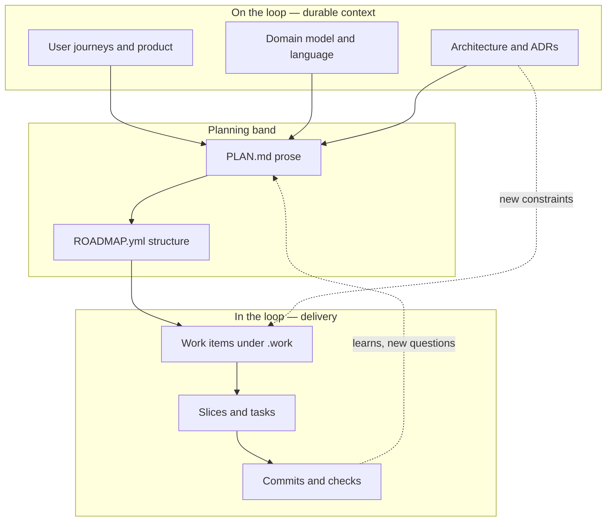

# User journeys

Narrative flows for how people (and agents) move through Kira-shaped work. Command references live in guides and `kira` help.

Primary readers are development teams using Kira with agents; including developer, product and design amongst others.

**Where this lives:** journey markdown is under **`.docs/product/user_journeys/`** (product docs). Sibling material under [`.docs/product/`](../README.md)—vision, personas, glossary, briefs—complements these files; keep **one narrative journey per file** here.

**Shape:** Each journey opens with a **Job to be done** (**As a** / **I want** / **So that**) and **`### Supporting evidence`** under that heading; **`### Measures of success`** also lives there for reading flow but should be **filled out last** (after stages and **success criteria**). Then **stages** over time, **touchpoints** (or **artifacts** for internal workflows), **pain points and opportunities**, and **success criteria**—aligned with familiar product practice, not a Kira-only scheme. Agents should follow [kira-define-user-journey](../../../.agents/skills/kira-define-user-journey/SKILL.md) when drafting or extending these files.

## Loops within loops

Product work is nested **feedback loops**—each with an artifact and a “definition of done,” each able to pause for **questions → answers → human confirmation** before the next loop tightens.

From coarse to fine:

1. **Direction and shared language** — Rationale, evidence, user journeys, domain language. Outcome: shared sense of *what world we are building in*.
2. **Architecture and durable decisions** — Structure, boundaries, non-goals. Outcome: ADRs and notes that *constrain* later work without specifying every ticket.
3. **Plan (prose)** — `PLAN.md`: sequencing, workstreams, risks, narrative “what ships when,” plus **working commitments** (assumptions you act on now and what would reopen them).
4. **Roadmap (structure)** — `ROADMAP.yml`: ordered tree, optional dependencies and metadata, ad-hoc vs real ids.
5. **Work items (truth)** — Files under `.work/`: authoritative elaborated behaviour, acceptance, links to ADRs.
6. **Slices and tasks (execution)** — `## Slices` and `kira slice`: committable steps and verifiable progress.

You do **not** need to finish outer loops before inner ones:

- **Roadmap before elaboration** — Rough `PLAN.md` + skeletal `ROADMAP.yml`, then promote ids and **elaborate per item** as you pull work forward.
- **Thin slice early** — One vertical slice end-to-end to learn while direction docs catch up.

**Habit at every band:** agent surfaces questions and options → human tightens or chooses → artifact updates. Bounded, batched answers can land **off the desk**; **companion-style flows** (future in Kira) extend that without losing traceability. **Tag and route** pairing, workshops, or multi-stakeholder sense-making so they are not queued like quick async resolves. Full journey (stages): [Answering questions on the loop](answering_questions_on_the_loop.md).

## On the loop vs in the loop

- **On the loop** — You invest in journeys, architecture, ADRs, skills, and plans so parallel work and agents need you **just in time** for decisions. Agents run in the background, ask **clear, bounded questions** (often with options); you answer in **short bursts** so they do not idle on the first unknown.
- **In the loop** — You work from work items and slices with minimal ceremony; many decisions are immediate. You still gain when upstream questions were already captured in durable artifacts.

**Coupling modes** (often several at once): **Delegation** (intent, constraints, success criteria) · **Notify** (progress and outcomes; room to intervene on drift or risk) · **Consent** (approve before binding others—canonical docs, roadmap promises, ADR status, high-blast-radius commits) · **Collaboration** (co-create when the answer is not a tidy multiple choice) · **Control** (override or halt when constraints or risk demand it).

**Snapshot vs evergreen** — Some files are **snapshots** (what you knew or committed when you wrote them). **Work items** under `.work/` are a strong snapshot layer: behaviour and scope for *this* funded slice. **Evergreen** material should constrain the next person until you deliberately revise it (typical: journeys, ADRs, `PLAN.md`, roadmap items you still stand behind). Be explicit about **which is which**: evergreen should move forward as you learn; agreed or historical snapshots should not be silently rewritten—supersede with a follow-on work item, addendum, or new doc.

**Where learning lands** — Refresh **evergreen** so it matches reality. For **snapshots**, carry intent forward in the **next** artifact or an explicit supersession path—not every file gets edited in place. Promoting binding rewrites still flows through **notify / consent / collaborate / control** so accountability stays clear.

Kira should support **entering at any band** (e.g. ship from a sliced work item without living in `PLAN.md`, or live in direction and roadmap until handoff).

## How to structure this folder

**One file per loop or per “moment.”** Do not mix “how we write ADRs” and “how we slice” in one doc—readers skim and agents blur scope.

| If the journey answers… | Typical home |
| --- | --- |
| Why and for whom (behaviour, value) | `.docs/product/user_journeys/…` or other files under `.docs/product/` |
| What we decided and will not revisit without intent | `.docs/architecture/` (ADRs) |
| How we turn a card into committable work | `.docs/product/user_journeys/` or `AGENTS.md` / agent skills |

**Name files by outcome**, not by tool (e.g. `capturing_architecture_decisions.md` not `adr_commands.md`).

**Use this README as the map:** list journeys below with one line each. Shared long diagrams can live here with links out.

**Optional numbering** for onboarding order (`01_shaping_direction.md`); otherwise alphabetical + this README is enough.

## Journeys in this repo

- [Answering questions on the loop](answering_questions_on_the_loop.md) — Questions at every loop level; batching and async answers so agents keep moving.
- [Creating a roadmap the Kira way](creating_a_roadmap.md) — From scattered intent to `PLAN.md`, `ROADMAP.yml`, funded work items, and slices.
- [Buyer receives and completes a checklist](buyer_receives_and_completes_checklist.md) — Product example: checklist delivery, progress, tracks, share/claim behaviour, e-sign items.

## Starter list (candidates to add next)

- **Shaping direction** — Noise → journeys + domain vocabulary; when to stop for clarifying questions.
- **From direction to ADRs** — ADR vs work item; feeding `PLAN.md` / roadmap.
- **Elaborating a work item** — Behaviour-first, handoff to slicing; LLM pairing without solution-drift.
- **Breaking work into slices** — Testable slices, `kira slice lint`, commit boundaries.
- **Replanning without losing history** — Draft/promote roadmaps, archive, communicate change.

## Diagram (same model, one view)

Solid arrows: typical “tightening” flow. Dotted: feedback outward without undoing the whole stack.

## Articulation trick (when you feel stuck)

Per candidate journey file, answer these before the **stages** (they become the **Job to be done** and optional **Scenario** / **Trigger** lines):

1. **As a** — Who is the single primary actor?
2. **I want** — What outcome does this journey deliver?
3. **So that** — Why does that matter (concrete benefit)?
4. **Scenario** — When does this run; what is true about the situation?
5. **Trigger** — What makes someone start this path?
6. **Exit** — What artifact or state proves the loop closed?
7. **Question habit** — What should the LLM ask before writing or changing code?

**One file = one scenario.** If you cannot answer (7), the loop is still too big—split it.

For **material product bets**, also stress-test **value**: what **evidence** supports the job (**`### Supporting evidence`** early), and what **measures of success** apply once the flow and **success criteria** exist (**`### Measures of success`**—complete last; see [kira-define-user-journey](../../../.agents/skills/kira-define-user-journey/SKILL.md)).
